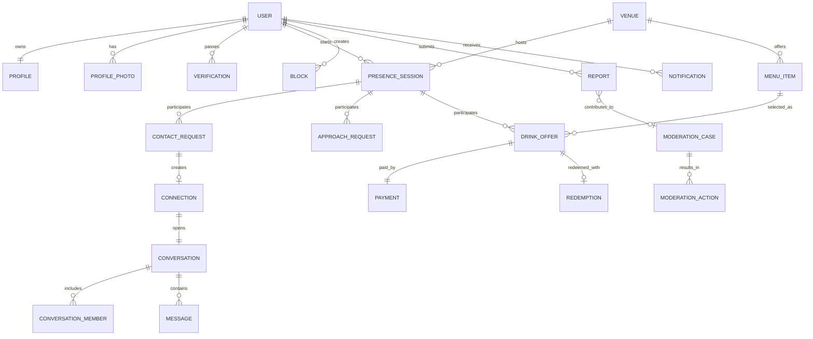
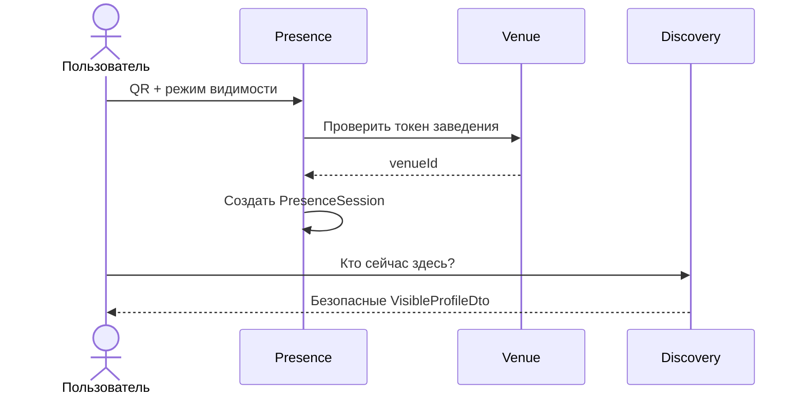
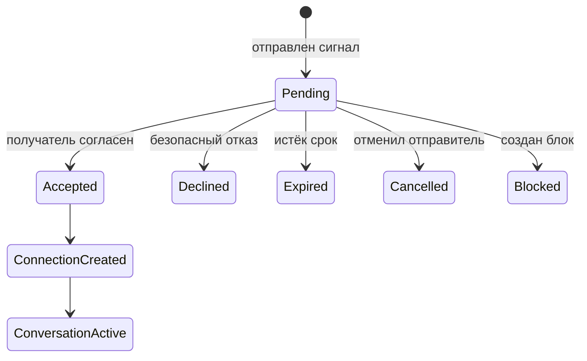
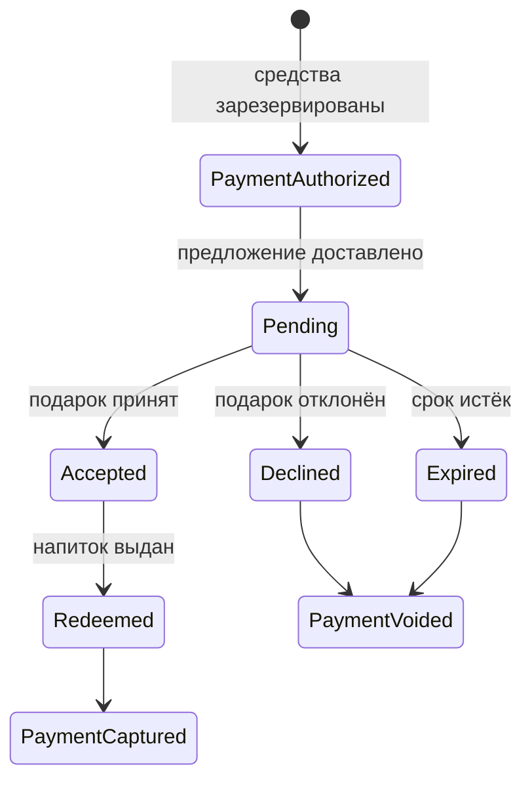
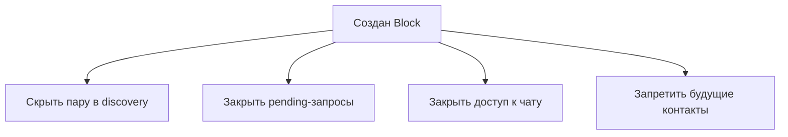

# Сущности предметной области и их связи

Статус документа: концептуальная модель MVP.  
Назначение: объяснить агентам смысл сущностей, границы агрегатов и последствия взаимодействий без привязки к конкретной СУБД или фреймворку.

Точные поля, перечисления и форматы находятся в `AGENT_DATA_CONTRACTS.md`.

## 1. Что моделирует продукт

Продукт — безопасный цифровой слой поверх знакомств и общения в реальном заведении. Он отвечает на три разных вопроса:

1. Кто добровольно видим и открыт к общению здесь и сейчас?
2. Какие формы взаимодействия между двумя людьми явно разрешены?
3. Как безопасно провести отдельную коммерческую операцию с напитком?

Модель не должна превращать подарок в обязанность. Поэтому универсальной сущности `Match`, объединяющей интерес, чат, напиток и личную встречу, нет.

## 2. Карта сущностей

Связи от `PresenceSession` к направленным взаимодействиям представлены концептуально: каждая такая запись хранит сессию отправителя и сессию получателя.

## 3. Контексты предметной области

| Контекст | Сущности | Ответственность |
|---|---|---|
| Identity | `User`, `Profile`, `ProfilePhoto`, `Verification`, `Device` | учётная запись, публичное представление, доверие |
| Venue | `Venue`, `VenueCheckInToken`, `MenuItem`, `VenueStaff` | партнёрское заведение, вход, меню, сотрудники |
| Presence | `PresenceSession` | временная видимость «здесь и сейчас» |
| Social | `ContactRequest`, `Connection`, `Conversation`, `ConversationMember`, `Message`, `ApproachRequest` | согласие на общение и коммуникация |
| Commerce | `DrinkOffer`, `Payment`, `Redemption` | подарок, деньги и фактическая выдача |
| Trust & Safety | `Block`, `Report`, `ModerationCase`, `ModerationAction` | немедленная защита и разбор нарушений |
| Delivery | `Notification`, `DomainEvent` | доставка пользователю и интеграция внутренних процессов |

Границы контекстов важны: например, Social узнаёт результат платежа через состояние предложения или событие, но не управляет реквизитами платежа.

## 4. Описание сущностей

### `User`

Корень личности и жизненного цикла аккаунта. Хранит авторизационные и закрытые данные, общий статус доступа. Не содержит публичное описание и не обозначает роль в знакомстве.

Связан с:

- одним `Profile`;
- фотографиями и верификациями;
- множеством сессий присутствия во времени;
- взаимодействиями в роли отправителя или получателя;
- блокировками, жалобами, уведомлениями и устройствами.

### `Profile`

Редактируемая публичная самопрезентация пользователя: имя, возраст через вычисление, описание, цели общения и режим личного подхода по умолчанию.

`Profile` не доказывает, что пользователь сейчас находится в заведении. Для выдачи всегда нужна действующая `PresenceSession`.

### `ProfilePhoto`

Отдельный объект изображения с порядком и состоянием модерации. Разделение позволяет модерировать и удалять фото независимо от профиля.

### `Verification`

Факт проверки определённого вида, а не просто флаг в `User`. У одного пользователя может быть несколько проверок, повторные попытки и срок действия результата.

### `Venue`

Заведение-партнёр, внутри которого формируется локальная выдача пользователей и выполняется выдача напитков. Его часовой пояс нужен для правил работы и аналитики, но время системы хранится в UTC.

### `VenueCheckInToken`

Короткоживущий или ротируемый секрет, закодированный в QR/другом механизме входа. Подтверждает доступ к созданию сессии для конкретного заведения. Сам по себе не доказывает постоянное физическое присутствие, поэтому дополняется сроком и heartbeat.

### `MenuItem`

Товар заведения, доступный для предложения. Текущая цена не должна изменять ранее созданные предложения; `DrinkOffer` хранит снимок названия и стоимости.

### `VenueStaff`

Связывает уполномоченного сотрудника с заведением и позволяет подтверждать выдачу напитка. Не следует смешивать с обычным профилем посетителя: права сотрудника задаются отдельно и ограничены его заведением.

Запись MAY ссылаться на `User`, если используется общая авторизация, но это не делает сотрудника видимым посетителем: для видимости всё равно нужна отдельная `PresenceSession`.

### `PresenceSession`

Центральная сущность продукта. Означает: пользователь подтвердил нахождение в конкретном заведении, добровольно включил или временно скрыл видимость, а сессия ещё действительна.

Она связывает пользователя и заведение и задаёт контекст для:

- попадания в список присутствующих;
- сигнала интереса;
- предложения напитка;
- запроса разрешения подойти.

Сессия не должна становиться пользовательской историей посещений. После завершения она исключается из любых discovery-запросов и затем удаляется или обезличивается по политике хранения.

### `ContactRequest`

Направленный запрос от одного присутствующего к другому. Это бесплатный или базовый сигнал интереса и запрос на открытие общения, но не право подойти.

Получатель может принять или безопасно отклонить без объяснений. После отказа повтор в рамках той же сессии получателя запрещён.

### `Connection`

Стабильный факт взаимного разрешения общаться, созданный при принятии `ContactRequest`. Отделён от запроса, потому что запрос — переходный процесс, а связь — результат согласия.

`Connection` не означает принятия подарков или согласия на личную встречу.

### `Conversation`

Канал сообщений, принадлежащий одной `Connection`. Жизненный цикл разговора можно закрывать отдельно от исходного запроса.

### `ConversationMember`

Членство пользователя в разговоре и персональное состояние: прочтение, mute, выход. В диалоге MVP всегда два участника, но отдельная сущность не смешивает общее состояние разговора с пользовательским.

### `Message`

Сообщение участника или системное сообщение. Оно доступно только членам разговора. Текст не должен копироваться в общие аналитические события и уведомления без необходимости.

### `ApproachRequest`

Отдельное краткоживущее согласие на переход из цифрового общения к личному подходу. Оно привязано к текущим сессиям в заведении и теряет силу при завершении сессии получателя.

Сущность нужна, чтобы настройки `chat_only` и `ask_before_approach` имели проверяемое серверное значение, а не были только подписью в интерфейсе.

### `DrinkOffer`

Предложение конкретного напитка от одного пользователя другому. Хранит участников, заведение, позицию меню и снимок цены. Может быть связано с `Connection`, если продукт разрешает подарки только после начала общения.

Ключевая граница: `accepted` означает только согласие получить напиток.

### `Payment`

Финансовая операция плательщика для одного `DrinkOffer`. Отвечает за авторизацию, списание, отмену авторизации и возврат. Её статусы не следует сворачивать в статус предложения: бизнес-ответ получателя и ответ платёжного провайдера меняются независимо.

### `Redemption`

Однократное право получить уже принятое предложение в заведении. Связывает коммерческое обещание с фактической выдачей сотрудником или интеграцией.

### `Block`

Немедленное одностороннее средство защиты. Наличие блока в любом направлении запрещает discovery и новые взаимодействия между парой пользователей. Блокировка действует сразу и не зависит от решения модератора.

### `Report`

Заявление о нарушении с указанием цели: профиль, сообщение, запрос, подарок или поведение в заведении. Жалоба не обязана создавать блокировку и не должна сама по себе немедленно доказывать нарушение.

### `ModerationCase`

Рабочее дело модерации. Может объединять несколько жалоб на одного пользователя, хранить приоритет и ответственного.

### `ModerationAction`

Отдельное решение по делу: предупреждение, ограничение, приостановка, бан или отклонение жалобы. История действий не должна перезаписываться одним флагом.

### `Notification`

Пользовательская доставка факта о событии. Содержит безопасный минимум данных и ссылку на доменную сущность. Не является источником истины: потеря уведомления не меняет состояние запроса или платежа.

### `DomainEvent`

Версионированная запись уже совершившегося доменного факта для интеграций, аналитики и надёжной доставки побочных действий. Не заменяет транзакционные таблицы.

## 5. Кардинальности и правила ссылок

| Источник | Связь | Цель | Правило |
|---|---:|---|---|
| `User` | 1:1 | `Profile` | профиль создаётся при онбординге |
| `User` | 1:N | `Verification` | сохраняются попытки/виды проверки |
| `User` | 1:N | `PresenceSession` | исторически много, одновременно максимум одна действующая |
| `Venue` | 1:N | `PresenceSession` | сессия принадлежит ровно одному заведению |
| `Venue` | 1:N | `MenuItem` | товар нельзя использовать в другом заведении |
| `PresenceSession` | N:N через поля ролей | `ContactRequest` | запрос фиксирует обе сессии |
| `ContactRequest` | 1:0..1 | `Connection` | связь появляется только после принятия |
| `Connection` | 1:1 | `Conversation` | для MVP один диалог на связь |
| `Conversation` | 1:N | `ConversationMember` | для MVP ровно два активных участника при создании |
| `Conversation` | 1:N | `Message` | сообщения принадлежат одному разговору |
| `PresenceSession` | N:N через поля ролей | `ApproachRequest` | разрешение ограничено текущим визитом |
| `PresenceSession` | N:N через поля ролей | `DrinkOffer` | обе стороны должны быть в одном заведении при отправке |
| `MenuItem` | 1:N | `DrinkOffer` | предложение также хранит snapshot |
| `DrinkOffer` | 1:1 | `Payment` | одна логическая платёжная операция, допускающая смену статусов |
| `DrinkOffer` | 1:0..1 | `Redemption` | создаётся после принятия или заранее в неактивном виде |
| `User` | N:N через `Block` | `User` | направленная запись, запрет двусторонний |
| `Report` | N:0..1 | `ModerationCase` | жалоба может ожидать группировки в дело |
| `ModerationCase` | 1:N | `ModerationAction` | сохраняется журнал решений |

## 6. Агрегаты и транзакционные границы

### Агрегат присутствия

Корень: `PresenceSession`.

Отвечает за создание, heartbeat, видимость, истечение и завершение. Создание новой действующей сессии должно проверить отсутствие другой действующей сессии пользователя.

### Агрегат запроса на общение

Корень: `ContactRequest`.

Принятие запроса — одна транзакция, которая:

1. переводит запрос из `pending` в `accepted`;
2. создаёт `Connection`;
3. создаёт `Conversation`;
4. создаёт двух `ConversationMember`;
5. записывает доменное событие для уведомления.

### Агрегат разговора

Корень: `Conversation`.

Проверяет статус и членство перед созданием `Message`. Закрытие или блокировка запрещает новые сообщения, не удаляя автоматически историю.

### Агрегат предложения напитка

Корень: `DrinkOffer`; связанные участники процесса — `Payment` и `Redemption`.

Из-за внешнего платёжного провайдера вся цепочка не является одной длинной транзакцией. Каждый переход идемпотентен, а рассогласования исправляются повторной обработкой событий/задачей сверки.

### Агрегат безопасности пары

Корень команды: `Block`.

Блокировка должна атомарно создать запрет и закрыть доступные социальные взаимодействия. Платёжные компенсации выполняются отдельно, потому что внешний провайдер не участвует в транзакции БД.

## 7. Основные взаимодействия

### Вход и выдача присутствующих

Перед выдачей фильтруются истёкшие/скрытые сессии, блоки, неактивные аккаунты и сам пользователь.

### Сигнал интереса и чат

Отказ не раскрывает причину и блокирует повтор от того же отправителя в рамках текущей сессии получателя.

### Разрешение подойти

| Режим получателя | Поведение |
|---|---|
| `chat_only` | личный подход не разрешён через приложение |
| `ask_before_approach` | нужен отдельный принятый `ApproachRequest` |
| `may_approach` | профиль сообщает об общем разрешении на текущий визит; окончательная трактовка остаётся `TBD` |

Даже принятое разрешение не раскрывает столик или координаты и может быть отозвано завершением присутствия или блокировкой.

### Предложение и выдача напитка

Диаграмма отражает рекомендуемую схему, а не окончательно принятое финансовое решение. `Accepted` не открывает чат и не разрешает подход.

### Блокировка

Факт и причина блокировки не доставляются заблокированному пользователю.

## 8. Матрица разрешений

| Действие | Минимальные условия | Результат |
|---|---|---|
| Начать присутствие | активный и верифицированный аккаунт, валидный токен заведения | новая `PresenceSession` |
| Увидеть профиль | обе стороны имеют видимое активное присутствие в одном заведении, нет блока | `VisibleProfileDto` |
| Послать интерес | обе сессии действуют, нет блока и повтора, лимиты соблюдены | `ContactRequest(pending)` |
| Принять интерес | получатель владеет pending-запросом, срок не истёк | `Connection` + `Conversation` |
| Написать | отправитель — активный член активного разговора | `Message` |
| Попросить разрешение подойти | режим допускает запрос, обе сессии действуют | `ApproachRequest(pending)` |
| Предложить напиток | политика продукта допускает, позиция доступна, обе стороны в заведении | `Payment` + `DrinkOffer` |
| Принять напиток | получатель предложения, срок не истёк | `DrinkOffer(accepted)` и право на выдачу |
| Выдать напиток | код/QR действителен, предложение принято, сотрудник уполномочен | `Redemption(redeemed)` + захват платежа |
| Заблокировать | целевой пользователь существует и не равен инициатору | `Block` и прекращение взаимодействий |
| Пожаловаться | допустимая цель принадлежит контексту взаимодействия | `Report` |

## 9. Что намеренно не связано автоматически

| Факт | Не означает |
|---|---|
| Пользователь видим в заведении | он согласен на любой контакт |
| Отправлен `ContactRequest` | чат уже открыт |
| Принят `ContactRequest` | разрешено подойти лично |
| Принят `DrinkOffer` | открыт чат или требуется общение |
| Создан `Block` | доказано нарушение и нужен бан |
| Создан `Report` | пользователь автоматически заблокирован заявителем |
| Завершён визит | профиль или аккаунт удалён |

## 10. Правила для агентов

При добавлении функций агент должен:

1. Определить контекст и владельца состояния.
2. Проверить, не объединяет ли новая логика независимые согласия.
3. Привязать действия «здесь и сейчас» к обеим `PresenceSession`, а не только к `userId`.
4. Не возвращать хранимые сущности напрямую — проектировать безопасный DTO.
5. Описать допустимые переходы состояния и идемпотентность.
6. Проверить последствия блока, завершения присутствия и истечения срока.
7. Записать доменное событие без лишних персональных данных.
8. Не считать пункт из раздела `TBD` утверждённым продуктовым решением.

## 11. Открытые продуктовые вопросы

1. Разрешён ли `DrinkOffer` без активной `Connection`.
2. Когда захватывается платёж и когда возможен возврат.
3. Как именно сотрудник или POS подтверждает выдачу.
4. Сколько живёт присутствие и как часто нужен heartbeat.
5. Каков срок хранения завершённых сессий и сообщений.
6. Можно ли написать текст до открытия чата.
7. Требует ли режим `may_approach` отдельного запроса.
8. Будет ли направленное принятие запроса или взаимный like/match.

Эти вопросы должны решаться в продуктовой политике. До этого модель оставляет связи опциональными и не допускает неявного согласия.
